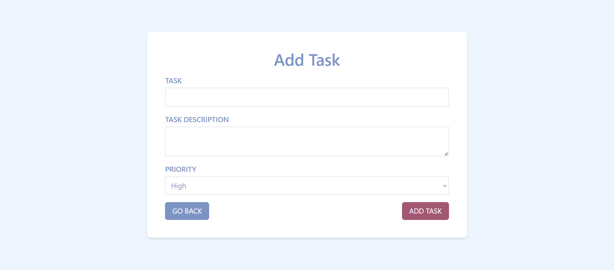

# React Todo App

A robust Todo application built with React.js, featuring a context for managing todos with functions like add, toggle, edit, and delete. Todos are stored in state and local storage.

## Table of Contents
- [Features](#features)
- [Project Structure](#project-structure)
- [Setup](#setup)
- [Usage](#usage)
- [Screenshots/GIFs](#screenshotsgifs)

## Features

- **Add Todo:** Add new tasks with descriptions and priority levels.
- **Edit Todo:** Modify existing tasks, including task name, description, and priority.
- **Delete Todo:** Remove tasks from the list.
- **Toggle Todo Completion:** Mark tasks as completed or incomplete.

## Additional Features

- **Sorted List:** Todos are sorted based on priority and completion status

## Project Structure

The project follows a modular structure:

react-todo-app/.
|-- src/ .
| |-- components/ .
| | |-- Task.jsx .
| | |-- Sidebar.jsx .
| |-- context/ .
| | |-- TodoContext.js .
| |-- pages/ .
| | |-- Home.jsx .
| | |-- AddTask.jsx .
| | |-- EditTask.jsx .
| |-- App.js .
| |-- index.js .
| |-- index.css .
|-- package.json .
|-- tailwind.config.js .
|-- README.md .

- `components/`: Contains the reusable `Task` component and `Sidebar` component.
- `context/`: Manages the global state and functions related to todos.
- `pages/`: Includes different pages for the app - Home, AddTask, and EditTask.
- `App.js`: The main component where routing is configured.
- `index.js`: The entry point of the application.

## Setup

1. **Clone the repository:**
- git clone https://github.com/hixmanshu00/react-todo.git
- cd react-todo

2. **Install dependencies::**
- npm install

## Usage
1. **Run the application:**
- npm start
- Your Todo app should now be accessible at http://localhost:3000.

## Screenshots

### Home Page

### Add Task Page

### Edit Task Page

